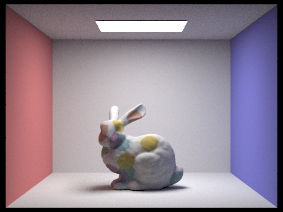
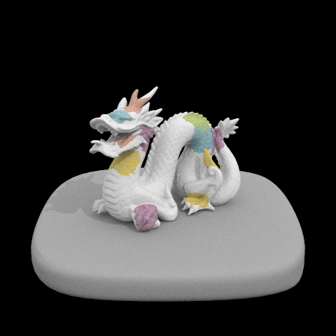
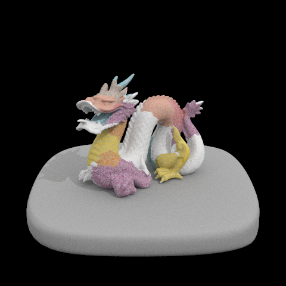
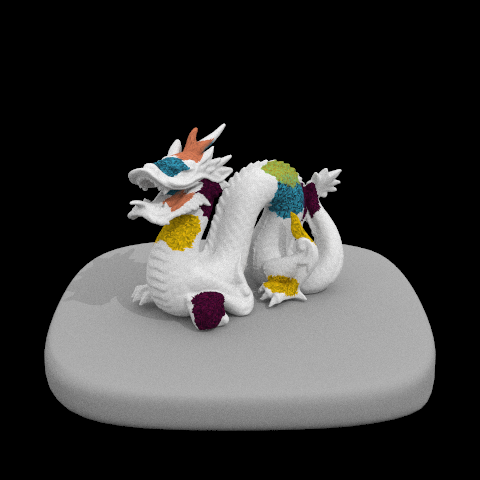

# 184 Final Project Report: Watercolor-esque Non-Photorealistic Rendering

## Abstract
This project aims to create non-photorealistic rendering of watercolor-esque images. Drawing inspiration from existing literature on generative rendering of watercolor onto 2D spaces as a pre-processing simulation (Curtis et al., 1997), we apply similar ideas to 3D rendering and implement watercolor style coloring for meshes in 3D image space. Our approach leverages and builds upon the previously completed ray-tracing renderer as a base, and utilizes techniques from Curtis et al., 1997 to allow for physical fluid simulation and a pigment based lighting model for water color shading. We present two watercolor-esque 3D renderers; one where additional simulation timesteps make the final rendering “drier” for realistic watercolor behavior, and another where we also apply the Kubelka-Munk compositing model to illustrate effects of paints overlapping.

## Technical Approach
Several approaches (Liu and Ma, 2001; Cheng,  2017) to generate watercolor-esque images use post-processing techniques such as shaders and mathematical color transformations. Instead, we draw ideas of watercolor physical simulation from Curtis et al., 1997 and apply them to 3D space, as we believe that actual simulation will most accurately mimic watercolor behaviors. Our project consists of two main components: the watercolor fluid simulation and the renderer. We describe the specific implementation of these components in the sections below.

### Fluid Simulation
The goal for the simulation is to create a 3-layer fluid simulation that accounts for pigment movement across mesh cells in water as well as absorption into and desorption from the “paper” mesh. The fluid simulation can be broken down into three layers - the shallow-water layer, the pigment-deposition layer, and the capillary layer. The shallow water layer is where the water and pigment flow above the surface of the paper. The pigment-deposition layer is where the pigment is adsorbed into and desorbed from the paper. Finally, the capillary layer is where the water is absorbed into the paper and diffused by capillary action, thus creating the back run effect.

We closely follow the 3-layer fluid simulation algorithms from Curtis et al., 1997, but modify them to match our 3D renderer instead of the paper’s 2D post-processing watercolorization. We found simulating paper to be the biggest challenge - Curtis et al., 1997 set the entire 2D scene as a whole 2D grid of paper cells with randomly generated height for “roughness”,  but we use the faces of the mesh object as our paper cells. As such, we adapt the fluid simulation of pigments flowing in 4 directions for each paper cell to just 3 directions for each face’s 3 neighbors. Height gradients were created via local differences of heights, and we generate the height variation through the face intersection angles to other neighboring faces. Intuitively, a face *F* whose neighboring faces are tilted towards its normal will have a smaller height, while a face *F2* with neighbors pointing away from its normal will have a larger height. This technique produces heights that are highly dependent on local context; future work might include incorporating convexity information from a wider set of faces than just immediate neighbors.

### Renderer
In this project, the renderer is used to generate water-color-esque patches of pigment on any object mesh. We build upon our previously created ray-traced renderer to allow different faces of a mesh to have different reflectance spectrums. To do this, we modify faces of the HalfedgeMesh during the simulation phase to hold a desired reflectance spectrum (set at the end of simulation), then propagate that spectrum into the primitives used by the renderer. Finally, we modify our ray-tracing code so the bidirectional scattering distribution function (BSDF) of “watercolored” meshes uses that custom reflectance.

### Implementation
In our implementation, we run everything in a simulate_mesh function that takes in a mesh object. Drawing from Curtis et al., 1997, we run four main steps at each time step: *MoveWater*, *MovePigment*, *TransferPigment*, and *SimulateCapillaryFlow*. We start by generating water color patches (collections of mesh Faces that we want to watercolor) and then instantiating them with all the parameters necessary for the simulation.

**MoveWater**: we update velocities in each direction for each cell to satisfy the 6 conditions for shallow water described in Curtis et al., 1997, and a discretization of the shallow water equations based on their grid structure is solved using Euler’s method. The first step of water movement involves updating water velocities across cell boundaries based on surrounding water velocities and cell water pressures. We store a non-negative outwards velocity in each halfedge, then update those velocities using a local coordinate system for each half edge that allows us to calculate analogs of the “horizontal” and “vertical” velocities of surrounding edges and cells.

**MovePigment**: we distribute pigments from each face to its neighbors according to the rate of fluid movement out of the cell in each direction.

**TransferPigment**: we adjust the amount of pigment on the paper by calculating how much pigment is absorbed into the paper and desorbed out of the paper through the pigment density, staining power, and granulation properties.

**SimulateCapillaryFlow**: the physical simulation in Curtis et al., 1997 also has a similar function that generates the backrun effect of diffusing paper through paper properties of pressure and saturation, but we elect not to do so since we already predefined watercolor patches before the simulation. Instead, we create a dry-brush effect, where a brush that is almost dry only applies paint to the rougher areas on the paper.

To properly display pigment colors, we follow Curtis et al., 1997 by implementing the Kubelka-Munk model to perform the optical compositing of pigment layers, with each pigment having absorption and scattering coefficients. The model then uses those coefficients to compute and display reflectance and transmittance. We also render several pigments colors with parameters from Curtis et al., 1997. Out of concern that the watercolor effects ignore the underlying mesh color, we add an implicit layer of "mesh colored" paint into every color-composition we render, yielding much better results (see figure 6).

## Results
In images with more simulation timesteps, the final rendering appears "drier", therefore making it look more like true watercolor. However, it can sometimes be hard to see watercoloring without strong illumination.


Figure 1: Bunny rendered with 10 timesteps of simulation



Figure 2: Bunny rendered with 100 timesteps of simulation


Figure 3: Bunny rendered with 1000 timesteps of simulation

The following images of dragons look more watercolor-esque because the scene is well-illuminated:



Figure 4: Dragon rendered with 1000 timesteps of simulation with direct lighting

The Kubelka-Munk compositing model is implemented to mimic the effects of watercolor paints overlapping: 



Figure 5: Same dragon with purple and yellow paints applied that overlap to create an orange color.

We saw poor results when we didn't account for the underlying color of the mesh. We found that including the underlying mesh color as an implicit "layer of paint" was crucial to generating the above images so they did not end up looking extremely saturated with paint like the image below.



Figure 6: Same dragon, but without rendering the implicit layer of "mesh colored" paint

## Video
https://youtu.be/FOn81lEtZzE

## Conclusion
### Issues Faced

One of the hardest challenges we faced is the calculation of realistic velocities and flow. In Curtis et al., 1997, the velocities were solved forward using Euler’s method in a 2D square grid. Working with 3D meshes with faces as paper cells, we are unsure whether our adaptation of their discretization to 3D meshes is mathematically valid. Since we didn’t implement capillary flow, we also do not take into account saturation or capacity of the “paper” (mesh).

Another issue is getting the pigment rendering to appear more watercolor-esque. Since we render our 3D mesh objects under lighting and shading, it is difficult to see the differences in watercoloring - the renders that work best are under good lighting conditions (see figure 4). We also ran into a slight issue where extra simulation steps tend to cause “spotty” concentration of watercolor, which we are unable to fully resolve. We also perform much more complicated math than anticipated to get the angle between adjacent faces (a simple inverse cosine of normal vector dot product doesn’t work because *cos(x) = cos(-x)* and we care about the sign of *x*)

### Lessons Learned
The main lesson we learned is that a paper writeup is not as simple as 1-1 with an implementation, especially when there are more components involved. We originally presumed that this project would be mostly about implementing and extending ideas in Curtis et al., 1997, but later realized that this was much more complex than expected - namely because we were rendering in 3D with lighting involved. Due to time constraints, we should have more carefully planned out our project and then gradually added features, instead of directly writing code without giving thought to the overall implementation details. Lastly, we all learned to appreciate simulation renderers much more - there is much more to physical watercolor fluid simulations than we expected and it was very rewarding to tackle it with our own ideas. We learned a great deal more about optical compositing to display color, physical paper and fluid properties, and special watercolor features.


## References
* Eric B. Lum, Kwan-Liu Ma. 2001. [Non-Photorealistic Rendering
using Watercolor Inspired Textures and Illumination](https://www.dimap.ufrn.br/~motta/dim102/Projetos/NPR/Lume_PG01.pdf)
* Ji Cheng. 2017. [ART DIRECTED WATERCOLOR SHADER FOR NON-PHOTOREALISTIC
RENDERING WITH A FOCUS ON REFLECTIONS](https://core.ac.uk/download/pdf/154406433.pdf)
* Cassidy J Curtis, Sean E. Anderson, Joshua E. Seims, Kurt W. Fleisher, and David H. Salsin. 1997. [Computer-Generated Watercolor](https://www.cs.princeton.edu/courses/archive/fall00/cs597b/papers/curtis97.pdf).

## Contributions
* Andrew: Implemented and re-designed fluid simulation with algorithms from Curtis et al., 1997, and implemented extra features such as dry-brush effect.
* Evan: Modified existing project 3-1 code to render water colors instead. Designed height function and mesh-specific adaptations to the water movement simulation functions.
* Johnathan: Implemented fluid simulation with algorithms from Curtis et al., 1997, and tweaked parameters to find optimal simulation values for most watercolor-esque results.

## Code: *MoveWater*, *MovePigment*, *TransferPigment*, *SimulateCapillaryFlow*, and *Watercolor Mesh Simulation*
Full project code can be found at: https://github.com/andrewdotwang/WatercolorRendering
### MoveWater
```C++
// main function for moving water in the shallow water layer
void WaterColor::move_water(std::vector<FaceIter> patch) {
  update_velocities(patch);
  relax_divergence(patch);
  flow_outward(patch);
}
```
```C++
// updating velocities, changing velocity in each direction by random factor scaled by height differential in that direction
void WaterColor::update_velocities(std::vector<FaceIter> patch) {
  for (FaceIter f: patch) {
    HalfedgeIter& h = f->halfedge();
    for (int i = 0; i < 3; i++) {
      h->wc_mag = max(0.0f, (float)(h->wc_mag + f->h_slopes[i]));
    }
  }
  float timesteps, dt;
  get_timescale(patch, &timesteps, &dt);

  StatsBuilder sb;
  sb.clear();

  for (int t = 0; t < int(timesteps); t++) {
    for (FaceIter f: patch) {

      // we look at each (half-)edge of each triangle. 
      // in general terms, "h" is f->halfedge(); the current half edge getting velocity updated
      //                   "u" is the velocity across the boundary

      // the visualization for "upper", "lower", "leftmost", and "rightmost" is as follows:
      //                    /||\                                                          |
      //        upper left / || \ upper right
      //                  / h||  \                                                        |
      //                  \  ||  /
      //        lower left \ || / lower right
      //                    \||/

      //                   "v" is the velocity perpendicular to the boundary (i.e. in the direction of h)
      // in terms of mapping a halfedge mesh onto a grid,
      // we use the following defns:

      // [ u_{i + .5, j} == h->wc_mag ] i.e. the velocity across the half edge we will modify
      // [ u_{i, j}      == avg_of(f->all_h->wc_mag) proj onto f_to_h] i.e. find the component of the average
      //                                                               exit velocity in the direction of exit from h
      // [ u_{i+1, j}    == avg_of(f->h->twin->all_h->wc_mag) proj onto f_to_h] i.e. find the component of the 
      //                                                                        average exit velocity of the twin 
      //                                                                        face in the direction of exit from h's twin
      // [ u_{i+1.5, j}  == avg of "rightmost" twin halfedge vals proj onto f_to_h]
      // [ u_{i-.5, j}   == avg of "leftmost" halfedge vals proj onto f_to_h]

      // [ u_{i+.5,j-x} == avg of "lower" halfedge vels proj onto f_to_h]
      // [ v_{i+.5,j-x} == avg of "lower" halfedge vels proj onto h]
      // [ u_{i+.5,j+x} == avg of "upper" halfedge vels proj onto f_to_h]
      // [ v_{i+.5,j+x} == avg of "upper" halfedge vels proj onto h]
      //  in the above, x can be either .5 or 1

      HalfedgeIter& h = f->halfedge();
      float u_ij, u_ip1j, u_ip5jp5, u_ip5jm5, v_ip5jm5, v_ip5jp5, u_ip15j, u_im5j, u_ip5j;
      float up_l_x, lo_l_x, up_r_x, lo_r_x, up_l_y, lo_l_y, up_r_y, lo_r_y;
      float A, B;
      Vector3D f_cent = face_centroid(f);
      float tot_flow = 0.;
      for (int edge = 0; edge < 3; edge++) {
        if (h->isBoundary() || !h->twin()->face()->is_wc) {
          h->new_wc_mag = 0.; // boundary conditions
          continue;
        }

        Vector3D x_axis = face_to_edge(f_cent, h);
        Vector3D y_axis = h->next()->vertex()->position - h->vertex()->position;

        HalfedgeIter& ul = h->next();
        calc_vel_coords(&up_l_x, &up_l_y, x_axis, y_axis, ul);

        HalfedgeIter ll = ul->next();
        calc_vel_coords(&lo_l_x, &lo_l_y, x_axis, y_axis, ll);

        HalfedgeIter& t = h->twin();
        HalfedgeIter& lr = t->next();
        calc_vel_coords(&lo_r_x, &lo_r_y, x_axis, y_axis, lr);

        HalfedgeIter& ur = lr->next();
        calc_vel_coords(&up_r_x, &up_r_y, x_axis, y_axis, ur);

        u_ij = (up_l_x + lo_l_x + h->wc_mag)/3.;
        u_ip5j = h->wc_mag;
        u_ip1j = (up_r_x + lo_r_x - t->wc_mag)/3.; // subtract wc_mag bc it is in the opposite direction

        u_ip5jp5 = (up_l_x + up_r_x)/2.;
        u_ip5jm5 = (lo_l_x + lo_r_x)/2.;
        v_ip5jp5 = (up_l_y + up_r_y)/2.;
        v_ip5jm5 = (lo_l_y + lo_r_y)/2.;

        u_ip15j = (up_r_x + lo_r_x)/2.;
        u_im5j  = (up_l_x + lo_l_x)/2.;

        A = u_ij * u_ij - (u_ip1j * u_ip1j) + (u_ip5jm5 * v_ip5jm5) - (u_ip5jp5 * v_ip5jp5);
        B = u_ip15j + u_im5j + u_ip5jp5 + u_ip5jm5 - (4. * u_ip5j);

        FaceIter f2 = h->twin()->face();

        h->new_wc_mag = max(0.0001f, (float)(u_ip5j + dt * (A - (mu * B) + f->pressure - f2->pressure - kappa * u_ip5j)));
        //NOTE: might be better to store updates in a "new" variable then apply them all when done.
        tot_flow += h->new_wc_mag;

        h = h->next();
      }

      if (tot_flow > 1.) {
        h = f->halfedge();
        for (int edge = 0; edge < 3; edge ++) {
          h->new_wc_mag = max(0.0001f, (float)(h->new_wc_mag / tot_flow) - 0.001f); // we want positive numbers that add up to a little less than 1
          h = h->next();
        }
      }

      h = f->halfedge();
      for (int edge = 0; edge < 3; edge ++) {
        h->wc_mag = h->new_wc_mag; // update actual magnitudes to new computations
        h = h->next();
      }

    }
  }
}
```
```C++
//relaxing the divergence of the velocity field
void WaterColor::relax_divergence(std::vector<FaceIter> patch) {
  // instead of the edge-centric mapping we did in update_velocities,
  // in this function we have a much simpler conceptual approach. 
  // delta is a scaled form of the total divergence, which is simply
  // the sum of wc_mag for a given face
  int t = 0;
  float tau = 0.01;
  float delta_max = tau + 1; 

  StatsBuilder sb;
  HalfedgeIter h;
  while(t < 50 && delta_max > tau) {
    delta_max = 0.;
    for (FaceIter f : patch) {

      float tot_div = 0;
      h = f->halfedge();
      for (int i = 0; i < 3; i++) {
        tot_div += h->wc_mag;
        h = h->next();
      }
      delta = - xi * tot_div; //NOTE there is a typo in the paper, if you look at  "Realistic animation of liquids." p7-8,
                              // which Curtis '97 cites, Curtis '97  are missing a minus sign...

      f->pressure = max(f->pressure + delta, 0.f);
      h = f->halfedge();
      float tot_flow = 0.;
      for (int i = 0; i < 3; i++) {
        h->new_wc_mag = max(h->wc_mag + delta, 0.0001f); 
        tot_flow += h->new_wc_mag;
        h = h->next();
      }

      if (tot_flow > 1.) {
        h = f->halfedge();
        for (int edge = 0; edge < 3; edge ++) {
          h->new_wc_mag = max(0.0001f, (float)(h->new_wc_mag / tot_flow) - 0.001f); // we want positive numbers that add up to a little less than 1
          h = h->next();
        }
      }

      delta_max = max(delta_max, abs(delta));
      sb.add(delta_max);
    }

    for (FaceIter f : patch) {
      h = f->halfedge();
      for (int i = 0; i < 3; i++) {
        h->wc_mag = h->new_wc_mag; 
        h = h->next();
      }
    }
    t+= 1;
  }
  return;
}
```
```C++
//edge darkening, paper applies a gausian blur on water mask (faces with is_wc)
//can try another brute force way of only dealing with edge faces with is_wc
void WaterColor::flow_outward(std::vector<FaceIter> patch) {
  float remove_factor = 0.1; //tweak parameters??

  for (FaceIter f: patch) {

    HalfedgeIter& h = f->halfedge();
    for (int i = 0; i < 3; i++) {
      FaceIter f2 = h->twin()->face();

      if (!f2->is_wc) {
        f->pressure = f->pressure * remove_factor;
        break;
      }

      h = h->next();
    }
  }
}
```
### MovePigment
```C++
//distribution of pigments from cell (face) to neighbors according to the rate of fluid movement out of the cell
//velocity in different directions result in different amounts of pigment movement => impacted by height differential
void WaterColor::move_pigment(std::vector<FaceIter> patch) {
  float ts, dt;
  get_timescale(patch, &ts, &dt);
  int timesteps = int(ts);

  StatsBuilder sb;
  sb.clear();

  for (FaceIter f: patch) {
    f->pigments_g_new = f->pigments_g;
  }

  for (int t = 0; t < timesteps; t++) {
    for (FaceIter f: patch) {

      std::vector<FaceIter> neighbors;
      HalfedgeIter& h = f->halfedge();
      for (int i = 0; i < 3; i++) {
        FaceIter f2 = h->twin()->face();
        neighbors.push_back(f2);
        h = h->next();
      }

      for (int i = 0; i < f->pigments_g.size(); i++) {
        float change = 0.0;
        float tmp;
        HalfedgeIter& h = f->halfedge();
        for (int dir = 0; dir < 3; dir++) {
          if (neighbors[dir]->is_wc) {
            sb.add(h->wc_mag);
            tmp = max(0.0f, h->wc_mag * f->pigments_g[i]);
            neighbors[dir]->pigments_g_new[i] += tmp;
            change += tmp;
          }
          h = h->next();
        }
        
        f->pigments_g_new[i] -= change;
      }
    }
    for (FaceIter f: patch) {
      f->pigments_g = f->pigments_g_new;
    }
  }

}
```
### TransferPigment
```C++
//at each step of simulation, pigment is absorbed into the paper at certain rates, but also back into fluid at other rates
void WaterColor::transfer_pigment(std::vector<FaceIter> patch) {
  for (FaceIter f: patch) {
    if (f->is_wc) {
      for (int i = 0; i < f->pigments_g.size(); i++) {
        float delta_down = f->pigments_g[i] * (1.0 - f->height * f->granulation[i]) * f->density[i];
        float delta_up = f->pigments_d[i] * (1.0 + (f->height - 1.0) * f->granulation[i]) * f->density[i] / f->staining_power[i];
        if (f->pigments_d[i] + delta_down > 1) {
          delta_down = max(0.0, 1.0 - f->pigments_d[i]);
        }
        if (f->pigments_g[i] + delta_up > 1) {
          delta_up = max(0.0, 1.0 - f->pigments_g[i]);
        }
        f->pigments_d[i] += delta_down - delta_up;
        f->pigments_g[i] += delta_up - delta_down;
      }
    }
  }
}
```
### SimulateCapillaryFlow
```C++
//simulates how paper absorbs water and increases the water color area
void WaterColor::simulateCapillaryFlow(std::vector<FaceIter> patch) {
  float absorbtion_rate = 1.0; //tweak this parameter?
  float threshold = 0.5; //tweak this parameter?
  float min_saturation_diffuse_neighbors = 1.0; //tweak this parameter?
  float min_saturation_no_diffuse = 1.0; //tweak this parameter?

  for (FaceIter f: patch) {
    if (f->is_wc) {
      f->saturation += max(float(0.0), min(absorbtion_rate, f->capacity - f->saturation));
    }
    f->saturation_new = f->saturation;
  }

  for (FaceIter f: patch) {
    HalfedgeIter& h = f->halfedge();
    for (int i = 0; i < 3; i++) {
      FaceIter f2 = h->twin()->face();

      if (f->saturation > min_saturation_diffuse_neighbors && f->saturation > f2->saturation && f2->saturation > min_saturation_no_diffuse) {
        float delta_s = max(0.0, min(f->saturation - f2->saturation, f2->capacity - f2->saturation)/4.0);
        f->saturation_new -= delta_s;
        f2->saturation_new += delta_s;
      }

      h = h->next();
    }
  }

  for (FaceIter f: patch) {
    f->saturation = f->saturation_new;
    if (f->saturation > threshold) {
      f->is_wc = true;
    }
  }
}
```
### Watercolor Mesh Simulation
```C++
// Simulates watercolor paint spreading over a mesh.
// NOTE: we eventually will need to have a way of specifying how
//       the brush-strokes are specified. For now, we'll just initialize
//       uniformly at random or maybe using the z coordinate(?) of the mesh element for testing.
void WaterColor::simulate_mesh(GLScene::Mesh* elem) {
  HalfedgeMesh& mesh = elem->get_underlying_mesh();

  std::vector<std::vector<float>> patch_pigments;
  patch_pigments.push_back({1.0, 0.1, 1.0});
  patch_pigments.push_back({0.1, 1.0, 1.0});
  patch_pigments.push_back({1.0, 1.0, 0.1});
  patch_pigments.push_back({1.5, 0.5, 0.1});
  patch_pigments.push_back({0.1, 1.5, 0.5});
  patch_pigments.push_back({0.5, 0.1, 1.5});

  WC_Color QUINACRIDONE_ROSE = WC_Color(Vector3D(0.22, 1.47, 0.57), Vector3D(0.05, 0.003, 0.03), 0.02, 5.5, 0.81);
  WC_Color INDIAN_RED        = WC_Color(Vector3D(0.46, 1.07, 1.50), Vector3D(1.28, 0.38, 0.21),  0.05, 7.0, 0.40);
  WC_Color CADMIUM_YELLOW    = WC_Color(Vector3D(0.10, 0.36, 3.45), Vector3D(0.97, 0.65, 0.007), 0.05, 3.4, 0.81);
  WC_Color HOOKERS_GREEN     = WC_Color(Vector3D(1.62, 0.61, 1.64), Vector3D(0.01, 0.012, 0.003),0.09, 1.0, 0.41);
  WC_Color CERULEAN_BLUE     = WC_Color(Vector3D(1.52, 0.32, 0.25), Vector3D(0.06, 0.26, 0.40),  0.01, 1.0, 0.31);

  std::vector<WC_Color> all_colors = {QUINACRIDONE_ROSE, CADMIUM_YELLOW, CERULEAN_BLUE, INDIAN_RED};
  std::vector<WC_Color> all_colors_def = all_colors;

  WC_Color mesh_default = WC_Color(Vector3D(0.5, 0.5, 0.5)); // could probably get this directly from collada?
  all_colors_def.push_back(mesh_default);
  
  //num of rows is num of patches, num of cols is number of colors in all_colors
  //might adapt this in the future
  std::vector<std::vector<float>> colors_per_patch = {{1.0, 0.0, 0.0, 0.0}, {1.0, 0.0, 0.0, 0.0}, {1.0, 0.0, 0.0, 0.0}, {0.0, 1.0, 0.0, 0.0}, {0.0, 1.0, 0.0, 0.0}, {0.0, 1.0, 0.0, 0.0}, {0.0, 0.0, 1.0, 0.0}, {0.0, 0.0, 1.0, 0.0}, {0.0, 0.0, 1.0, 0.0}, {0.0, 1.0, 1.0, 0.0}, {0.0, 0.0, 1.0, 0.0}, {0.0, 0.0, 1.0, 0.0}, {0.0, 0.0, 0.0, 1.0}, {0.0, 0.0, 0.0, 1.0}};

  std::vector<float> densities;
  std::vector<float> stains;
  std::vector<float> grans;
  std::vector<float> pigments_d;
  for (WC_Color c: all_colors) {
    densities.push_back(c.density);
    stains.push_back(c.stain);
    grans.push_back(c.granulation);
    pigments_d.push_back(0.);
  }

  std::vector<std::vector<FaceIter>> patches;

  StatsBuilder sb;
  Vector3D f_cent;
  for (int patch = 0; patch<colors_per_patch.size(); patch++) {

    std::vector<FaceIter> newPatch = get_patch(mesh, 400, true);
    patches.push_back(newPatch);


    //need to instantiate properties of each face "cell" for simulation
    for (FaceIter f: newPatch) {
      f->is_wc = true; // tells the renderer to use this face's watercolor reflectance instead of the default

      // initialize simulation params (below are placeholders; remove or modify however you want)

      //f->wetness = (float)(random_uniform());
      float f_h = face_height(f);
      f->height = f_h;
      sb.add(f_h);

      //placeholder values, need to set default values
      f->xyz_flow = Vector3D(0.0, 0.0, 0.0); //need to set initial xyz_flow velocities to actually run update_velocities()?
      f->pressure = 1.0; //not used until we change fluid sim

      f->saturation = 1.0;
      f->saturation_new = 1.0;
      f->capacity = 1.0; //per paper, shoud be  c = h * (c_max - c_min) + c_min

      //all faces should have the same k pigments, varrying in property values
      //using placeholders, need to modify, can follow values in paper in figure 5
      std::vector<float> new_cpp;
      float val;
      for (int i = 0; i < colors_per_patch[patch].size(); i++) {
        val = colors_per_patch[patch][i];
        if (i < f->pigments_g.size()) {
          val += f->pigments_g[i];
        }
        new_cpp.push_back(val);
      }
      f->pigments_g = new_cpp;
      f->pigments_g_new = new_cpp;
      f->density = densities;
      f->staining_power = stains;
      f->granulation = grans;
      f->pigments_d = pigments_d;

      HalfedgeIter& h = f->halfedge();
      f_cent = face_centroid(f);
      for (int i = 0; i < 3; i++) {
        h->wc_dir = (face_to_edge(f_cent, h)).unit();
        h->wc_mag = 0.;
  
        h = h->next();
      }

    }

    sb.clear();

    //need to get a gradient of height differences for each direction, 3 in total
    for (FaceIter f: newPatch) {
      HalfedgeIter& h = f->halfedge();
      for (int i = 0; i < 3; i++) {
        FaceIter f2 = h->twin()->face();

        if (f2->is_wc) {
          f->h_slopes[i] = (f->height - f2->height); // / (norm(f1 - f2));
        } else {
          f->h_slopes[i] = 0.0;
        }
        h = h->next();
      }

    }

  }

  // loop through all the patches
  // run water simulation on each patch
  // end result will result in each face having multiple properties of pigments
  // find a way to set reflectance and transmittance values of the face to show true water color pigments
  for (std::vector<FaceIter> patch : patches) {
    int timesteps = 1000;
    for (int i = 0; i < timesteps; i++) {
      move_water(patch);
      move_pigment(patch);
      transfer_pigment(patch);
      simulateCapillaryFlow(patch);
    }
  }
  StatsBuilder sb_rgb[3];
  for (int i = 0; i < 3; i++) {
    sb_rgb[i] = StatsBuilder();
  }

  for (std::vector<FaceIter> patch : patches) {
    for (int i = 0; i < 3; i++) {
      sb_rgb[i].clear();
    }
    
    for(FaceIter f : patch) {
      float pigment_d_sum = 0.0;
      std::vector<float> factors;
      for (int i = 0; i < f->pigments_d.size(); i++) {
        pigment_d_sum += f->pigments_g[i] + f->pigments_d[i];
      }
      float to_push;
      float tot_pushed = 1e-5;
      for (int i = 0; i < f->pigments_d.size(); i++) {
        if (pigment_d_sum == 0) {
          to_push = 0.0;
        } else {
          to_push = (f->pigments_g[i]+f->pigments_d[i]);//1.2;
        }

        factors.push_back(to_push);
        tot_pushed += to_push;
      }

      // TODO: implement reflectance/transmittance layering
      // TODO: data structure to allow simple specification of a color from the paper

      std::vector<float> factors_def = factors;
      factors_def.push_back(1.0);

      Vector3D refl;
      Vector3D trans;
      float tot_thickness;
      calc_comp(all_colors_def, factors_def, &tot_thickness).calc_optics(tot_thickness, &trans, &refl);

      f->reflectance = refl;
      for (int i = 0; i < 3; i++) {
        sb_rgb[i].add(f->reflectance[i]);
      }
    }

    Stats s_rgb[3];
    for (int i = 0; i < 3; i++) {
      s_rgb[i] = sb_rgb[i].calc_stats();
      sb_rgb[i].print_stats();
    }
    which_patch += 1;
  }
}
```
